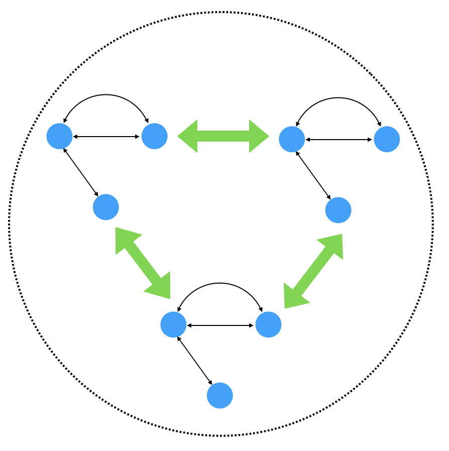

# 手把手教你使用Go语言实现分布式一致性算法：Raft算法：Part 0 - 简介

> 编译自[博客](https://eli.thegreenplace.net/2020/implementing-raft-part-0-introduction/)

> 大家快去看原英文博客。

> 我会补充和修改一些内容，来使得文章更容易理解。

分布式一致性问题号称分布式系统这一领域的**皇冠**。可以说是分布式系统领域最复杂的问题了（可能没有之一！）业界有很多分布式一致性算法的实现，但基本都来自于Leslie Lamport大神的Paxos算法（大神还开发了LaTex）。Paxos算法由于太过于复杂和难以理解，所以业界一直没有一个很好的实现。举几个例子：

* Google的Chubby分布式锁号称实现了Paxos，但开发者也说，等到Chubby开发完成，Chubby已经变成了一个没有经过形式化证明的分布式一致性算法了。也就是说，无法证明Chubby是一个正确的分布式一致性算法。
* Apache社区著名的组件Zookeeper所实现的Zab协议。这个协议似乎也没经过形式化证明（没仔细看过）。
* ElasticSearch也自己实现了一个分布式一致性算法，也没有经过形式化证明。所以一直再不断的修算法的Bug。

这时候在2014年，Raft算法横空出世了。Paxos算法经过了形式化证明，但由于原始论文写的太过简略，并且很多边界条件都没有给出解决方案。那么Raft算法的目的是什么呢？首先，实现和Paxos一样的功能，并且需要形式化证明。其次，Raft算法的设计目标就是**容易理解**！什么性能之类的，都靠边站，首先保证可理解性。这之后，分布式一致性算法的实现难度才算真正降下来。举几个例子：

* K8s依赖的协调组件etcd，etcd是一个分布式kv数据库，它使用Go语言实现了Raft算法。
* Tikv这一数据库，使用Rust语言实现了Raft算法。
* 甚至连Redis也提供了分布式一致性组件，叫做[redisraft](https://github.com/RedisLabs/redisraft)

本系列文章将介绍Raft分布式共识算法，并使用Go语言实现一个Raft算法。以下是本系列文章的目录：

* Part 0：简介（本篇文章）
* Part 1：选举
* Part 2：命令和日志复制
* Part 3：持久化和优化

这个系列的目标是描述一个完整的可以工作的且经过严格测试的 Raft 算法的实现，并提供一些Raft算法如何工作的直观讲解。文章的目的并不是为了成为学习Raft算法的唯一资源。我们假设读者已经至少读过一次Raft的原始论文。另外，非常推荐大家花一些时间去研究一样Raft网站上面的资源，看一看创始人的演讲，把玩一下算法的可视化动画，甚至去阅读一下Ongaro的博士论文来熟悉一下更多的细节（Ongaro的博士论文的最后附有很长的形式化证明，全是数学公式），等等。

不要想在一天之内就完全掌握Raft算法。即使Raft算法的设计初衷就是为了比Paxos算法更加容易理解，Raft算法仍然是非常非常复杂的。因为Raft算法解决的问题——分布式共识——本身就是一个非常困难的问题。所以算法的复杂程度和难度是有一个下限的，因为算法要解决的问题的难度已经决定了这一点。

## 复制状态机（Replicated State Machines）

分布式共识算法要解决的问题是什么呢？这个问题就是：在多个服务器之间复制一个确定性状态机（复习一下状态机相关的知识吧）。任何服务或者说任何程序都可以用状态机这个术语来表示。毕竟，状态机这个概念是计算机科学的基石之一，几乎计算机中的任何事物都可以被表示为一个状态机。数据库，文件服务器，锁服务器等等，都可以抽象成一个比较复杂的状态机。

如下图所示，我们用状态机（蓝色圆圈组成的服务）来表示一个后端服务。多个客户端可以连接这些服务然后发送请求，并等待响应：

我们后端服务可以表示为一个状态机。如果状态机中的每一步操作都是高可靠的，那么系统会工作的很好。而如果我们的服务器崩溃，服务就会不可用。一般来讲，我们的后端服务基本都是单点服务，例如：如果我们的MySQL数据库只部署在一台服务器上的话，那么这台服务器的崩溃将会导致整个服务不可用。也就是说我们的服务非常依赖单点服务器的正常运行。

想要提高服务的可用性，通常的方法是做备份。我们可以在不同的服务器上面运行多个服务的实例。某一个服务器的崩溃，并不会让我们的服务不可用。如果将这些服务器互相隔离开，将进一步提升了服务的可用性。

客户端将会和整个服务器集群进行通信，而不是和一个单独的服务器进行通信。另外，集群中的备份机器需要互相进行通信来复制状态，从而保证集群中的每台机器都有同样的状态：

上图中的每一个状态机都是一个服务的备份。我们的想法是：所有的状态机都从客户端接收相同的请求，然后执行相同的状态转移，而这个过程需要加锁。这样就保证了所有的服务器都可以给客户端返回相同的结果。即使一些服务器崩溃，也不影响服务。Raft算法就是这个想法的一个实现。

下面我们介绍一些术语：

* **服务**：服务是我们将要实现的分布式系统的**逻辑任务**。例如：KV数据库。
* **服务器或者副本（Replica）**：机器上运行了依赖Raft算法的服务，而这台机器和其他服务器以及客户端进行网络通信。
* **集群**：一组 Raft 服务器协作来实现一个分布式服务。典型的集群中机器的数量是 3 或者 5 。

## 共识模块和Raft日志

现在是时候研究一下上面的流程图中的某一个状态机了。Raft作为一个通用的算法，并不会要求服务器上运行的服务所抽象成的状态机是什么样子，换句话说，Raft算法用途非常广泛。Raft的唯一目标就是提供高可靠性，只要需要高可靠性的场景，都可以使用Raft算法。什么是高可靠性呢？也就是确定性的记录和重播输入到状态机中的序列（在Raft算法中称为命令）。给定一个初始状态和所有的输入，可以忠诚的按照原有顺序重新播放状态机的转移操作。我们可以从另一个角度来看一下这个问题：如果我们有两台独立的机器，上面运行着相同的状态机。给这两个状态机输入相同的输入序列，而两个状态机的初始状态也是相同的。那么两个状态机最终将会产生相同的状态，并且一直会产生相同的输出。

下面就是一个使用了Raft算法的服务器的结构图：

有关以上组件的一些细节：

* 图中的状态机和我们之间看过的图是一样的。它表示任意服务：通常使用KV数据库来作为讲解Raft算法的例子。
* 日志模块用来存储客户端所发送的所有命令（状态机的输入）。这些命令并不会直接输入到状态机中；而是当这些命令成功的拷贝到大部分服务器时，Raft算法才会将这些命令输入到状态机中。还有，日志是持久化的，也就是说，日志将会保存在一个持久化的存储设备上（文件系统之类的），防止服务器崩溃。而且当服务器崩溃以后，由于我们将命令进行了持久化，所以可以将这些命令重新输入到状态机中，来重新播放状态机的状态转移。
* 共识模块是Raft算法的核心。共识模块会接收来自客户端的命令，并保证这些命令保存在日志中，以及将这些命令复制到Raft集群中的其他机器上（绿色箭头），然后将这些命令提交给状态机执行（因为此时这些命令已经安全了）。提交给状态机以后，就会通知客户端真正的改变已经发生了。

如果觉得还没有理解清楚，不要担心。因为接下来将会详细解释上面所写的东西。

## 领导者（Leader）和跟随者（Follower）

Raft算法使用了**强领导者模式**，也就是集群中的某个机器作为领导者，而其他的机器都是跟随者。领导者负责接收客户端的请求，并将要执行的命令拷贝到跟随者，然后给客户端返回响应。

在正常的运行过程中，跟随者的目标很简单，就是复制领导者的日志。如果领导者崩溃或者出现网络分区，那么某个跟随者将会成为领导者，所以服务仍然是可用的。

这样的模型既有优点也有缺点。一个重要的优势是：模型非常简单。数据一直都是从领导者流向跟随者的。只有领导者可以向客户端返回响应。这就使得Raft集群很容易被分析，测试以及调试。而缺点就是性能了——因为集群中只有一个服务器（也就是领导者）可以和客户端通信，当客户端的请求很多时，这会成为瓶颈。那么怎么解决呢？答案就是：通常情况下，**不要**将Raft算法用于高并发的服务。Raft算法更加适合用于一些并发不高但一致性要求很高的场景，也就是说Raft算法为了强一致性而牺牲了可用性。我们将在容错那一节来继续讨论这个问题。

## 客户端与Raft算法的交互

早先，我说过“客户端将和整个集群进行通信，而不是只和一台机器通信”，那这句话是什么意思呢？一个集群就是一组服务器，这些服务器通过网络互相连接。那么客户端如何去和“整个集群”通信呢？

答案非常简单：

* 当客户端和一个Raft集群（也就是集群中的每台机器都运行着一个Raft算法的共识模块和日志模块）进行通信时，客户端是知道集群中的机器的ip地址的。那么客户端是怎么知道的呢？本篇专栏暂不讨论。
* 在开始时，客户端会向集群中的任意一个机器发送一个请求。如果这个机器是领导者机器，那么这台领导者机器将会立即接收这个请求，而客户端将会等待领导者的响应。之后，客户端将会记住这台机器就是领导者机器，客户端也不会再一次去集群中搜索领导者机器（直到出现故障，例如领导者机器崩溃，才会去重新搜索）。
* 如果这台机器告诉客户端机器说自己不是领导者机器，那么客户端将会尝试其他机器。这里我们可以做一个优化，就是这台机器可以告诉客户端哪一台机器是真正的领导者。因为集群中的机器是不断的在互相通信的。所以这台机器显然知道哪个机器是领导者。这可以节省客户端用于搜索领导者机器所耗费的大量时间。
* 另一种情况是：客户端向集群发送请求以后，已经过了超时时间（客户端等待响应的最大时间），客户端还没有收到响应，也就是客户端的请求没有被正式提交（commit），例如客户端的请求是在服务器上的kv数据库中进行a=1这样的赋值操作，结果过了超时时间，还没有赋值成功。这时客户端会意识到和它通信的这台机器不是领导者。这也意味着这台机器的确不是领导者机器（即使这台机器认为自己是领导者）。因为可能出现了这样的状况：这台机器和Raft集群的其他机器出现了网络分区的情况。当超时时间过去了，客户端会继续在集群中寻找其他领导者。

上面第三点所提到的优化在大部分情况下不是必要的。一般来讲，在Raft中区分“正常操作”和“故障场景”是非常有用的。一个典型的依赖Raft的服务的99.9%的时间都应该处于“正常操作”的场景，在这种场景下客户端是知道领导者是哪一台机器的，因为当客户端在开始和集群通信时就将领导者机器的ip地址信息缓存下来了。故障场景——我们要在下一节内容详细讲解——彻底把这潭水搅浑了，但只会持续很短的时间。我们后面将会详细学习，一个Raft集群将会很快的从暂时性的服务器故障或者网络分区的故障中恢复。也就是说，在大部分故障场景下，Raft服务会在1秒中之内就恢复过来。在新的领导者确认它的领导地位和客户端发现新的领导者这段时间内，将会出现短暂的服务不可用，但很快就会回到“正常操作模式”。

## Raft算法的容错性和CAP定理

> 在理论计算机科学中，CAP定理（CAP theorem），又被称作布鲁尔定理（Brewer's theorem），它指出对于一个分布式计算系统来说，不可能同时满足以下三点：
>
> * 一致性（Consistency） （等同于所有节点访问同一份最新的数据副本）
> * 可用性（Availability）（每次请求都能获取到非错的响应——但是不保证获取的数据为最新数据）
> * 分区容错性（Partition tolerance）（以实际效果而言，分区相当于对通信的时限要求。系统如果不能在时限内达成数据一致性，就意味着发生了分区的情况，必须就当前操作在C和A之间做出选择。）

让我们看下面的图，图中Raft集群中有三台机器，这个时候并没有客户端与之连接。

这个集群会出现什么故障呢？

在现代计算机中，每一个组件都可能出故障。而在Raft集群中，我们所说的组件就是一个Raft的实例，这个实例是一个**原子**单元。这样会比较容易讨论。如果以一个Raft实例作为最小原子单元的话，我们最常碰到的两种故障是：

1. 某台服务器崩溃，也就是说集群中的某台服务器在某段时间内对于任何网络请求都停止响应了。一台崩溃的服务器通常情况来讲会重启，也可能在一段时间之后重新上线。
2. 网络分区故障，也就是说一台服务器或者多台服务器和集群中其他服务器或者客户端失联了（网络分区，互相不能进行网络通信了）。可能是由于网络设备或者传输介质的故障引起的。

现在假设集群中的两台服务器分别为服务器A和服务器B。从服务器A的角度看，服务器B的崩溃和A、B之间的分区故障是无法区分的。因为它们的故障表现形式是一样的——服务器A接收不到服务器B的任何消息或者响应。从系统的角度来看，网络分区故障非常的阴险，因为网络分区故障会同时影响到很多的服务器。接下来，我们将会研究一些网络分区故障造成的很诡异的场景。

想要优雅的处理网络分区故障和服务器崩溃，Raft集群需要集群中的大部分机器正常运行，而且可以在任何时候对领导者进行响应。如果有3台服务器，Raft将会容忍1台机器出现故障。如果有5台服务器，Raft将会容忍2台服务器出现故障。所以可以推论出来，如果有`2N + 1`台服务器，集群将会容忍`N`台服务器出现故障。

这时候我们自然而然想起了CAP定理。由于我们无法避免网络分区故障的发生，所以我们必须仔细的权衡`可用性`和`一致性`到底哪一个更加重要。

当`可用性`vs`一致性`时，Raft算法坚定的站在了一致性的阵营。Raft算法的目标就是防止所有可能导致不一致状态的情形出现（所谓不一致，就是不同的客户端得到了不一致的响应）。为了一致性，Raft算法牺牲了可用性。

Raft算法的设计目的不是用在高并发、细粒度服务的场景。客户端的每次请求，都会触发一系列的工作——Raft集群中机器之间的通信，也就是将日志复制到集群中的大部分机器上面，并且要持久化存储日志。而只有这些都完成了，客户端才能得到响应。也就是说先要达到集群对于日志的一致性，然后才能返回给客户端响应。不想我们的单点MySQL服务，写入数据库然后直接返回响应（不存在一个达到一致性的过程）。这个达到一致性的过程显然需要花费时间。

例如，我们设计了一个分布式数据库，所有的请求都要通过Raft服务进行处理，这样肯定是不行的。因为这样整个服务会非常慢。Raft非常适合作为粗粒度的分布式原语（或者叫分布式锁），例如使用Raft算法来实现一个分布式锁服务，或者高层次协议的领导选举，或者关键配置文件在分布式系统中的复制等等这样一些对一致性要求很高的服务。

## 为什么使用Go

本系列所实现的Raft算法是用Go语言实现的。Go语言拥有三个优势，使得Go语言非常适合用来实现Raft算法以及一般意义上的网络服务（HTTP，RPC）等等。

1. 并发：像Raft这样的算法在本质上就是并发的。集群中的每台机器都在不停的运行各种操作：执行定时事件；响应集群中其他机器以及客户端的异步请求等等。这就是我选择Go语言来实现Raft算法的第一个理由。
2. 标准库：Go拥有一个强大的标准库。这使得在实现一些复杂的网络服务时，不需要使用第三方库。特别是Raft算法，碰到的第一个问题就是“如何在不同的机器之间发送消息”？很多朋友在这一步就会被卡住，因为这里会涉及到设计通信协议，序列化反序列化消息方面的问题，如果使用第三方库，又带来了很大的学习成本（网络通信库一般都比较庞大）。Go仅仅只需要使用`net/rpc`库就可以搞定这些需求了，不需要再导入其他库。对比Java，选择Netty还是用Akka，先来学一波Actor模式！
3. 简单性：实现一个分布式共识算法本身已经很难了。尽管我们用任何语言都可以写出清晰且简单的代码，但Go语言默认的用法本身就很简单。Go语言极尽所能的反对复杂（对比一下C++、Scala）。Go语言在语言设计的每一个层面都力求简单（可能会招来一些非议，例如没有泛型，不符合Haskell、Rust爱好者的品味等等）。

## 接下来的内容

Raft算法的概念理解起来似乎有点简单。其实这种简单很有欺骗性。因为当我们写代码真正去实现Raft算法时，才会发现有很多很多的坑。接下来的内容将会从深入挖掘Raft算法的每一个细节。

接下来我们开始实现Raft算法。