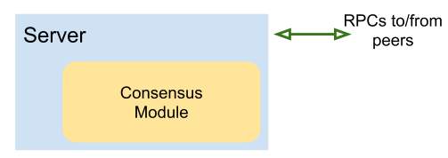
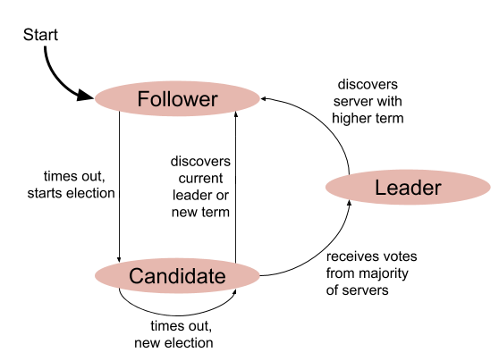

# 手把手教你使用Go语言实现分布式一致性算法：Raft算法：Part 1 - 选举

> 编译自[博客](https://eli.thegreenplace.net/2020/implementing-raft-part-1-elections/)

> 大家快去看原英文博客。

> 我会补充和修改一些内容，来使得文章更容易理解。

本系列文章将介绍Raft分布式共识算法，并使用Go语言实现一个Raft算法。以下是本系列文章的目录：

* Part 0：简介
* Part 1：选举（本篇文章）
* Part 2：命令和日志复制
* Part 3：持久化和优化

在这一部分，我将解释一下Raft算法实现的大概结构，并集中讨论一下`领导者选举`的实现。这一部分还没有涉及到如何来响应客户端的请求这一问题，也没有涉及如何去持久化日志。这些内容将放在下一部分实现。

## 代码结构

一般来说，我们会把Raft算法嵌入到某些服务中去。所以我们这里并不会去开发一个后端服务。但为了学习Raft算法，我会创建一个`Server`类型，这个`Server`类型里面包含一个`ConsensurModule`这样一个共识模块。这个共识模块包含了我们实现的Raft算法的大部分代码。



共识模块（CM —— ConsensusModule）实现了Raft算法的核心部分，在`raft.go`文件中。共识模块不涉及和集群中其他机器的通信的代码。在共识模块中，和网络通信有关系的字段只有以下几个字段：

```go
// id 就是当前 Server 的 id
id int

// peerIds 是一个int的列表，包含了集群中其他机器（服务）的 id
peerIds []int

// server 是一个包含了共识模块（CM）的 Server
// 用来想其他机器发送RPC请求
server *Server
```

在Raft算法的实现里，对于每一个Raft副本机器，集群中其他的副本机器都是`peers`（同事）。集群中每一个`peer`都有一个独一无二的ID，类型是整型。还有一个ID列表，里面保存了所有其他`peers`的ID。`server`字段是一个指针，指向了包含当前共识模块的服务，代码实现在`server.go`文件中。`Server`结构体使得共识模块可以给其他`peers`发送消息。我们后面会详细分析。

这样实现的目的是为了将网络通信的细节排除掉，使得我们可以集中精力在Raft算法本身上。如果我们将Raft算法的原始论文直接实现成代码（原论文细节阐述的很到位，几乎可以直接映射到代码），那么我们的代码其实只需要`ConsensusModule`结构体类型，以及结构体中的方法。而`Server`的代码其实就是Go的普通网络编程，外加一些小技巧来使得我们的代码可以通过一些严格的测试。这篇文章我们先不讨论这部分。

## Raft服务器的状态

从比较抽象的角度来看，一个Raft共识模块是一个有三个状态的状态机：



上一篇文章，我们说了很多Raft如何实现状态机。其实上篇文章所说的状态机和这里说的状态机不是一回事儿。Raft算法可以实现任意的复制状态机（也就是说每个服务器要复制相同的状态机），而Raft本身其实也拥有一个小的状态机。Raft实例拥有三个状态：领导者、跟随者和候选者。Raft实例的身份是在这三个状态之间来回转移的。

>说白了，只要有状态的转移，就都可以叫做状态机。

在一个比较稳定的场景中，集群中会有一台服务器是领导者，其他服务器都是跟随者。我们当然希望这样稳定的场景可以一直持续下去，毕竟Raft算法的目标就是超强的容错性。所以我们重点要讨论的就是各种边界条件（服务器宕机，网络断开之类的场景），来看一下Raft是如何实现强一致性的。

我们之前提过，Raft使用的是强领导者模型。领导者会

* 响应客户端的请求
* 将新的日志（entries、命令）添加到日志（log）中
* 将日志复制到跟随者中

每一个跟随者都随时准备着成为领导者，单等领导者宕机或者无法通信。而这个状态转移对应了`times out, start election`这个转移，也就是在流程图中，`跟随者`->`候选者`。

## 任期

就像我们平常所碰到的`选举`这个词的含义，Raft的领导者也是有任期（term）的。对于一台服务器来说，它作为领导者的这段时间，就是这台服务器的任期。一轮新的选举，将会产生一个新的任期。Raft算法保证了每一个任期只有一个领导者。

Raft算法中的选举和我们现实中的选举不能进行过度类比，因为它们有不同的地方。Raft中的选举和我们现实中的选举区别还是很大的。Raft算法中的选举，更多的是集群中服务器的合作完成的（而不是你死我活）。Raft算法中的`候选者`并不会不惜一切代价赢得选举。所有候选者的目标都是尽快产生领导者，也就是说只要有机器是领导者就可以了。

## 选举定时器

Raft算法中一个重要的基础组件就是选举定时器。每一个跟随者都在不断的运行这个选举定时器。每当跟随者收到当前领导者的消息，都会重启定时器。领导者会周期性的向跟随者发送心跳消息。所以当跟随者接收不到领导者的心跳消息时，跟随者会假设领导者宕机或者网络连接断开了。接下来，就会启动一轮选举。也就是，跟随者的状态会转移成候选者的状态。

问：那岂不是所有跟随者会同时成为候选者吗？

答：选举定时器是随机的，而这是Raft算法之所以简单的一个关键。Raft使用了随机化来降低多个跟随者同时发起选举的概率。但是即使跟随者同时成为了候选者，对于每一个任期来讲，也只会产生一个领导者。在极为罕见的场景下，选票可能被瓜分了（比如，两台跟随者同时发起选举，得到了相同数量的选票），然后没有候选者可以赢得选举。这时，一轮新的选举（当然，任期号也会更新）将会启动。虽然理论上存在无限次重启选举这种情况（这样就永远选不出领导者了），但由于我们使用随机化，所以这样的概率简直是太低了。我们来看一下原始论文怎么说：

>Raft 算法使用随机选举超时时间的方法来确保很少会发生选票瓜分的情况，就算发生也能很快的解决。为了阻止选票起初就被瓜分，选举超时时间是从一个固定的区间（例如 150-300 毫秒）随机选择。这样可以把服务器都分散开以至于在大多数情况下只有一个服务器会选举超时；然后他赢得选举并在其他服务器超时之前发送心跳包。同样的机制被用在选票瓜分的情况下。每一个候选人在开始一次选举的时候会重置一个随机的选举超时时间，然后在超时时间内等待投票的结果；这样减少了在新的选举中另外的选票瓜分的可能性。

>这里的随机化，指的是选举超时时间是随机的（150～300毫秒）。

问：那如果一个跟随者和集群的其他机器出现断网情况呢（网络分区）？这样这个跟随者机器岂不是会启动一轮新的选举（因为这台跟随者机器接收不到领导者的心跳信息了）？

答：这就是网络分区的阴险之处了。跟随者无法区分到底是谁和大部队失联了。到底是这台跟随者和集群失联了，还是领导者和集群失联了？所以这台跟随者会启动一轮新的选举（跟随者->候选者）。但如果情况是这台跟随者和集群失联的话，那么这轮选举将不会产生结果——因为这台跟随者和大部队失联了，所以根本无法和其他`peers`进行网络通信，也就是说根本无法接收到任何选票。由于接收不到选票，所以这台跟随者会一直`自旋`在候选者状态，也就是说隔一段时间就会启动一轮新的选举。直到这台跟随者重新连上集群中的其他机器，才会停下来。我们后面再详细讨论这种情况。